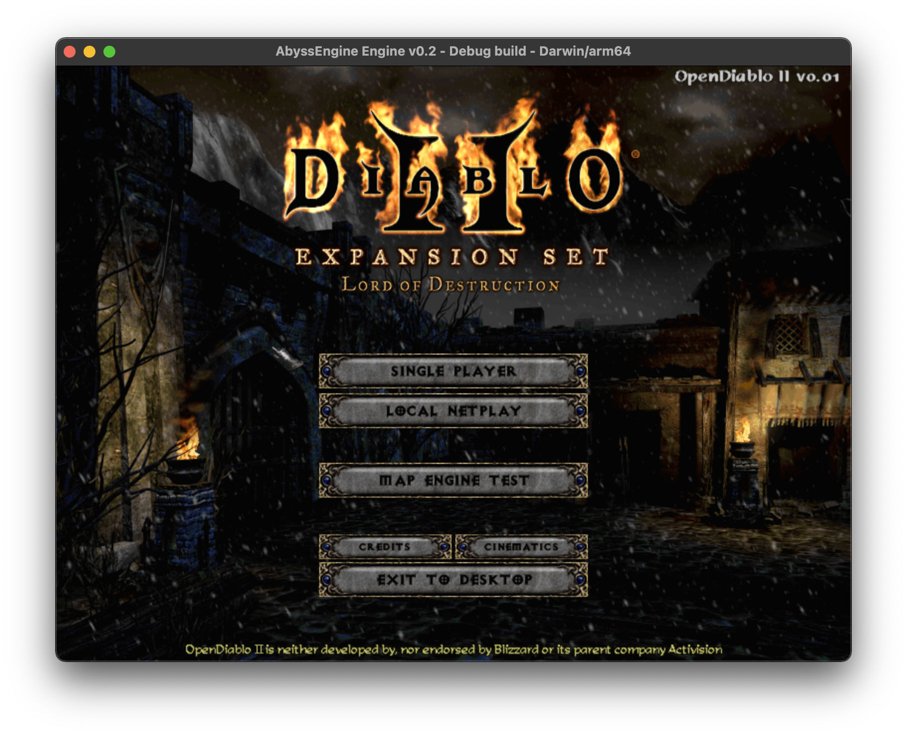
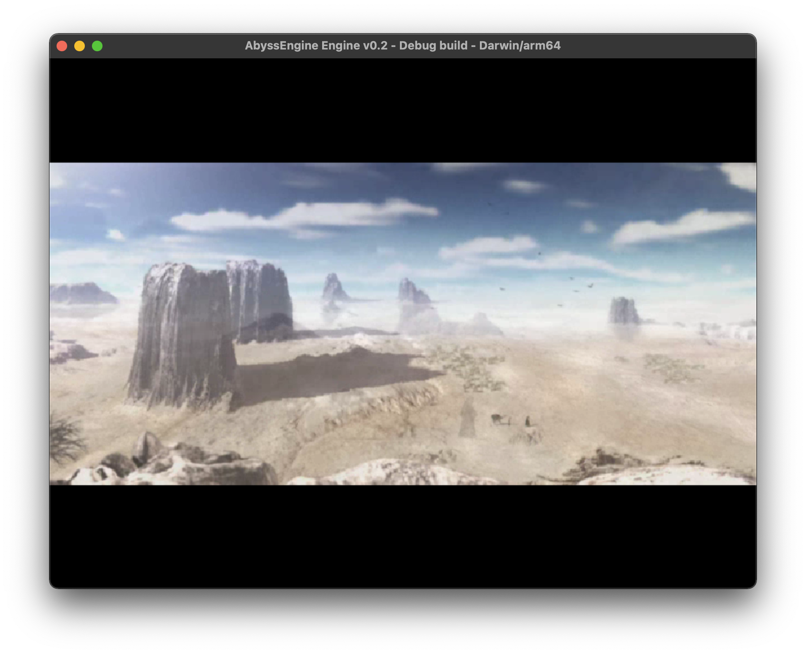

Join us on IRC: [irc.libera.chat #opendiablo2](https://web.libera.chat/#opendiablo2)

# OpenDiablo2
OpenDiablo2 is an implementation of Diablo 2 in AbyssEngine.

This game requires the [Abyss Engine](https://github.com/AbyssEngine/AbyssEngine) to run, as well as the MPQ files provided by the official Diablo 2 + LOD installers (online, CD, or digital).

Please note that we only support users who are using an official and legally owned copy of the original game (not D2 Resurrected). If you do not have a copy of the game and/or do not use a Windows computer, it is recommend that you purchase the Windows edition of the [Diablo 2](https://us.shop.battle.net/en-us/product/diablo-ii) and [LOD Expansion](https://us.shop.battle.net/en-us/product/diablo-ii-lord-of-destruction) from the Blizzard store directly, and install/patch it on another machine, or in a virtual machine in order to obtain the MPQ files. MPQs/disks downloaded from unofficial sources tend to have mods/changes that are not supported.

# General Information
This project is currently very early stages of development, and is not in a playable state yet. The game is being developed in tandem with the Abyss Engine, though all contributors are encouraged to help directly with this project instead of the core engine itself.

Current Features:
* Main Menu
* Cinematics Screen

In Progress:
* Map Engine Tests Screen
* Credits Screen
* New Hero Screen

Todo:
* Gameplay (when the engine supports it)

# Installation

1. Download OpenDiablo2 to a folder (or clone the repo)
1. Copy the data files over from the copy of Diablo II you have. You need to do at least one of the following:
   1. If you have good old Diablo II (latest LOD patch required), copy the MPQs from the game's installation folder into the DATA\MPQ-D2 folder of this project (there should be 11 MPQs).
      * DO NOT DELETE THE `.loadorder` file from this folder, it should be a hidden file on most systems. 
   1. If you have Resurrected, copy Data/ and .build.info files from it into D2RData folder of this project. Speficially, the file structure should be like this:
      * DATA/CASC-D2R/.build.info
      * DATA/CASC-D2R/Data/indices
      * DATA/CASC-D2R/Data/config
      * DATA/CASC-D2R/Data/data
1. Download a binary of the Abyss Engine for [Windows](https://github.com/AbyssEngine/AbyssEngine/releases/download/unstable/abyss-windows.zip), [Linux](https://github.com/AbyssEngine/AbyssEngine/releases/download/unstable/abyss-linux.tar.gz), or [MacOS](https://github.com/AbyssEngine/AbyssEngine/releases/download/unstable/abyss-darwin.dmg), and extract it to the root OpenDiablo2 folder.
1. Run the Abyss Engine application.

Please note that the Abyss Engine is in very active development, and new features are added on a daily basis. It is recommended that you grab a new copy of the engine any time you update your copy of this repo.

# Screenshots

